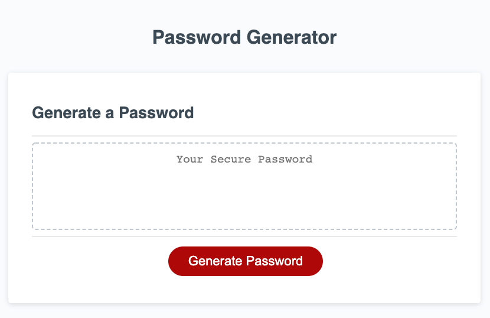

# HW3 Password Generator

## Link
https://angelfloreschicago.github.io/hw3_passwordGenerator/

## Page Guide/Description
- This is a simple password generator.
- When the "Generate Password" button is clicked ther will be prompts.
- These prompts ask the user if they want their password to include
  uppercase, lowercse, symbols, numbers and the length of the password.
- The generated password displays inside the text box. 
- The user can simply copy and paste the paswword like they normally would
  be able to do with other text. 

## Notes
- This website is still a work in progress. My JavaScript skills are still not
  the best but this project has definitely helped me improve my skills. Stay tuned 
  for future improvements to this project like improved CSS styles and JavaScript
  using the DOM.